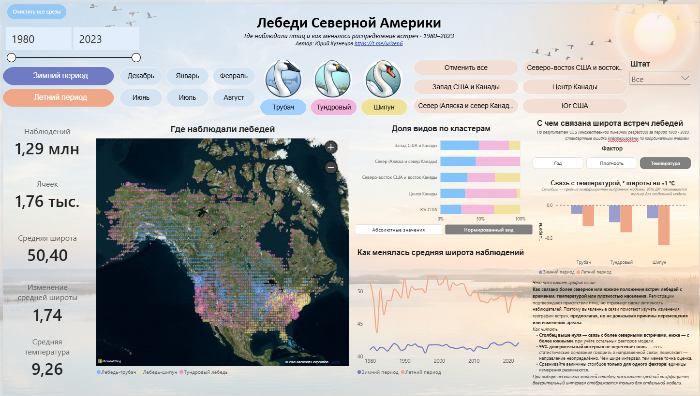

[](powerbi/swans_north_america.pbix)

Исследование географии регистраций трёх видов лебедей в Северной Америке за **1980–2023 годы**:

- лебедь-трубач;
- тундровый лебедь;
- лебедь-шипун.

Проект объединяет исследовательский анализ в Python, подготовку данных и дашборд в Microsoft Power BI.

> Регистрации отражают реальные встречи птиц, но не являются полной картиной их присутствия. Отсутствие регистрации не доказывает отсутствие птиц: на результаты влияют территория, сезон и активность наблюдателей. Выводы описывают географию наблюдений и статистические связи, а не доказывают причины изменения ареала.

## Цель проекта

- показать, где регистрировали лебедей разных видов;
- изучить изменение широты регистраций во времени;
- сравнить виды, сезоны и пространственные кластеры;
- оценить связь широты регистраций с годом, температурой и плотностью населения.

## Структура репозитория

| Файл или папка | Назначение |
|---|---|
| `notebooks/SWANS.ipynb` | Исследование: предобработка, разведочный анализ, кластеризация, статистические тесты и регрессии |
| `notebooks/PBI_SWANS.ipynb` | Подготовка таблиц и показателей для Power BI |
| `screenshots/` | Скриншоты страниц и состояний дашборда |
| `README.md` | Описание проекта и руководство по дашборду |
| `data/` | датасеты и справочники |

## Данные и единица анализа

Используются регистрации лебедей с пространственной и временной привязкой, а также данные о температуре и плотности населения. Основная пространственная единица анализа — координатная ячейка.

Ключевые признаки:

- вид, год, месяц и сезон;
- координатная ячейка, широта и долгота;
- административный регион и пространственный кластер;
- число наблюдений, температура и плотность населения.

Для сопоставления используются зимний и летний периоды. Период анализа: **1980–2023**.

## Этапы работы

### 1. Исследовательский ноутбук

В `SWANS.ipynb` выполнены:

1. загрузка и проверка исходных данных;
2. очистка и подготовка пространственных, временных и видовых признаков;
3. разведочный анализ распределения регистраций;
4. сравнение видов и сезонов;
5. выделение пространственных кластеров;
6. статистический анализ различий между группами;
7. построение множественных линейных регрессий.

Регрессионная модель имеет вид:

```text
широта ~ год + температура + плотность населения
```

Для отдельных сочетаний вида, сезона и кластера используется множественная линейная регрессия OLS. Стандартные ошибки кластеризуются по координатным ячейкам. Модели рассчитываются по всему доступному периоду конкретной группы; слайдер периода в Power BI эти модели не пересчитывает.

### 2. Подготовка данных для Power BI

В `PBI_SWANS.ipynb` формируются:

- факты регистраций;
- справочники видов, сезонов, регионов и времени;
- координатные ячейки и пространственные кластеры;
- агрегированные показатели по годам и месяцам;
- результаты регрессионных моделей;
- коэффициенты и 95% доверительные интервалы.

Подготовка отделяет данные интерактивных визуализаций от результатов статистических моделей, рассчитанных заранее.

## Дашборд Power BI

### Назначение

Дашборд показывает, **где наблюдали лебедей и как менялась география встреч**. Он предназначен для сравнения видов, сезонов, регионов и периодов, а также для изучения статистических связей широты регистраций с выбранными факторами.

### Скриншоты


### Ссылка на дашборд


### Управление

- **слайдер периода** — выбор начального и конечного года;
- **виды лебедей** — трубач, тундровый и шипун;
- **сезон** — зимний или летний период;
- **региональные кнопки** — выбор пространственного кластера;
- **штат** — фильтрация по штату;
- **«Очистить все срезы»** — сброс выбранных фильтров.

Выбор фильтра обновляет связанные графики, карту и карточки. При выборе нескольких видов, сезонов или кластеров показатели объединяются в текущем контексте фильтрации.

### Элементы дашборда

#### Карточки показателей

Карточки показывают:

- число регистраций;
- число координатных ячеек;
- среднюю широту регистраций;
- изменение средней широты между первым и последним выбранными годами;
- среднюю температуру.

Изменение средней широты рассчитывается как разность средней широты последнего выбранного года и средней широты первого выбранного года. Положительное значение означает более северное положение регистраций в конце периода.

#### Карта «Где наблюдали лебедей»

Карта отображает координатные ячейки, в которых зарегистрированы наблюдения. Цвет помогает различать виды. Карта позволяет увидеть пространственное распределение регистраций и его изменение при выборе фильтров.

#### «Распределение видов по кластерам»

Горизонтальная составная диаграмма показывает количество регистраций выбранных видов в пространственных кластерах. Переключатель позволяет просматривать абсолютные значения или нормированное распределение вида.

#### «Как менялась средняя широта наблюдений»

Линейный график показывает среднюю широту регистраций по годам отдельно для зимнего и летнего периодов. Он помогает увидеть долгосрочную динамику и различия между сезонами.

#### «С чем связана широта встреч лебедей»

Диаграмма построена по результатам множественной линейной регрессии OLS. Переключатели позволяют выбрать фактор:

- год;
- плотность населения;
- температура.

Столбец показывает коэффициент регрессии, то есть направление и величину статистической связи фактора с широтой регистраций при учёте остальных факторов модели. Положительный коэффициент соответствует более северным регистрациям, отрицательный — более южным.

Отрезок показывает 95% доверительный интервал. Если он не пересекает ноль, данные дают статистические основания говорить о направленной связи в рамках модели. Это не является самостоятельным доказательством причинного влияния фактора на перемещение птиц.

Коэффициенты разных факторов нельзя напрямую сравнивать по высоте столбцов: год, температура и плотность населения имеют разные единицы измерения.

При выборе нескольких моделей диаграмма может показывать среднее коэффициентов выбранных моделей. Такой диапазон отражает разброс коэффициентов, а не 95% доверительный интервал среднего.

## Интерпретация результатов

Результаты позволяют оценить, какие условия и периоды связаны с более северным или южным расположением зарегистрированных встреч. Они дают основание для дальнейшего изучения изменений распределения лебедей, но не отделяют полностью влияние факторов от особенностей наблюдений.

На географию регистраций могут влиять:

- реальное присутствие и перемещения птиц;
- доступность территорий для наблюдений;
- различия в активности наблюдателей;
- сезон и год;
- плотность населения;
- особенности покрытия территории исходными данными.

Корректная формулировка вывода — **«фактор статистически связан с широтой регистраций»**, а не **«фактор доказанно вызвал перемещение птиц»**.

## Ограничения

- Регистрационные данные не являются систематическим учётом всех птиц.
- Отсутствие регистрации не означает отсутствия вида в конкретном месте.
- Модели описывают связи, а не доказывают причинность.
- Сравнение коэффициентов разных факторов требует учёта их единиц измерения.
- Результаты регрессии относятся к доступному периоду и конкретной группе вида, сезона и кластера.

## Воспроизводимость

Для повторения анализа откройте ноутбуки в Jupyter Notebook или JupyterLab и последовательно выполните ячейки. Перед запуском проверьте пути к исходным данным и установленные библиотеки Python, используемые в ноутбуках.


## Автор

Юрий Кузнецов

[](https://github.com/Urizen-Data)
[](https://t.me/urizen6)
[](mailto:urizen@rambler.ru)
